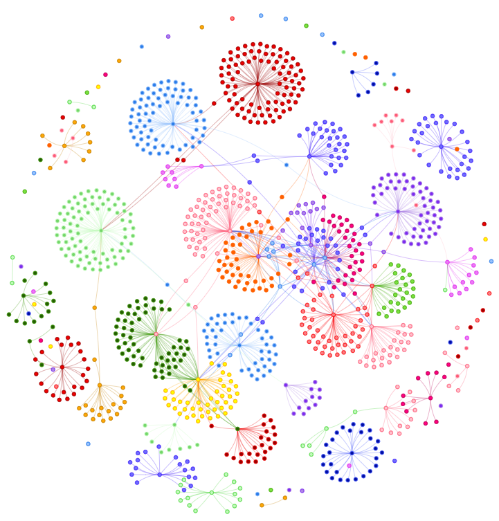

# ARTICLE NETWORK MAP

This website creates a network graph of articles using their references.

Project Requirements:

- User will enter a list of DOIs to a search box.
- We obtain article data from CROSSREF API (https://api.crossref.org/works/).
- Article data includes:

```JavaScript
{
  DOI: article[i]['DOI'],
  label: article[i]['DOI'],
  title: article[i]['title'][0],
  author: article[i]['author'],
  reference: article[i]['reference'],
  'container-title': article[i]['container-title'],
  published: article[i]['published'],
  URL: article[i]['URL'],
  'references-count': article[i]['references-count'],
  'is-referenced-by-count': article[i]['is-referenced-by-count'],
  volume: article[i]['volume'],
  'references-count': article[i]['references-count'],
  url: 'https://doi.org/' + article[i]['DOI'],
  ref_count: article['is-referenced-by-count'],
  }
```

- We use VIS.js (https://visjs.org/) to draw the graph.
- VIS.js options:

```JavaScript
const options = {
    nodes: {
      shape: 'dot',
      scaling: {
        min: 5,
        max: 20,
      },
      size: 10,
      font: {
        size: 16,
        face: 'Roboto Condensed',
      },
    },
    physics: {
      minVelocity: 0.75,
      solver: 'repulsion',
    },
    interaction: {
      hideEdgesOnDrag: true,
      tooltipDelay: 200,
    },
    layout: {
      improvedLayout: false,
      randomSeed: 30,
    },
    edges: {
      color: {
        inherit: true,
      },
      width: 0.5,
      smooth: {
        enabled: true,
        type: 'dynamic',
      },
    },
  };
```

End result should look like this:


